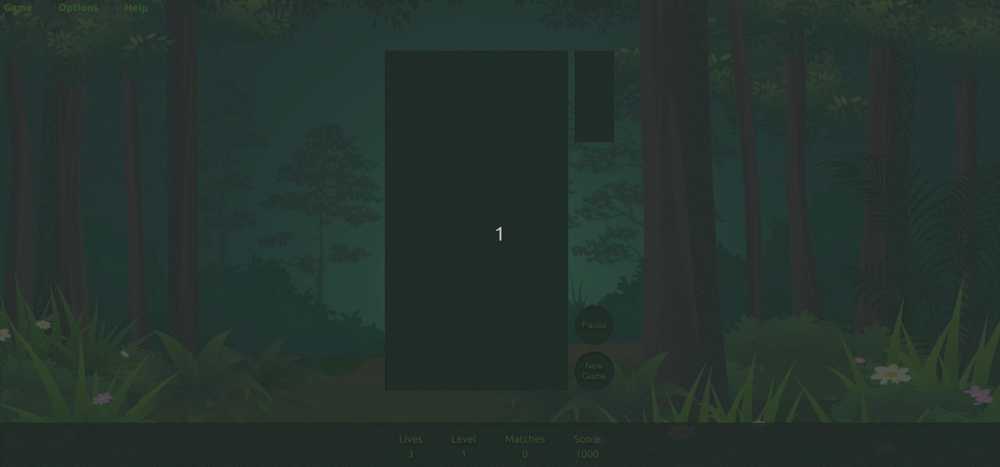

<h1 align="center">HI there, I'm Michael. </h1>

<h3 align="center">Born 🇦🇺 => Studied 🇬🇧 => Settled 🇨🇦</h3>
 

<section align="center">
📈&nbsp; I'm currently working as a Developer for [reSolved](https://re-solved.ca/).
 
🎙️&nbsp; I'm also assisting at a leading podcast hosting platform, [Transistor.fm](https://transistor.fm).
</section>

<section align="center">
<h2>💡Projects💡</h2>
<table bordercolor="#66b2b2">
  <tr>  
    <td width="50%" valign="top">
      <h3>Forest Friends</h3>

  

    
      

        
<strong>JavaScript, HTML (canvas), CSS</strong> – A personal homage to the Macintosh game Jewelbox (1992) and Sega Columns (1990) built using the canvas element.

    </td>
    <td width="50%" valign="top">
      <h3>RentProof</h3>

  

   
      

        
<strong>React, SCSS, Google Maps API, Node/Express, PostgreSQL</strong> – RentProof tracks rental price data uploaded by users in order to provide a detailed price history of properties over time. This makes it possible to quickly compare individual price fluctuations with the rest of the market.

    </td>
  </tr>
</table>
</section>

 

<section align="center">
<h2>📈 Activity 📈</h2>

 
  

  

  
  

  

  
  

</section>

 

<h2 align="center">:computer: Working Knowledge :computer:</h2>

<table>  
  <tr>
    <td>Languages</td>
    <td align="center" height="108" width="108">
      
       <strong>Python</strong>
    </td>
    <td align="center" height="108" width="108">
      
       <strong>JavaScript</strong>
    </td>
    <td align="center" height="108" width="108">
      
       <strong>TypeScript</strong>
    </td>
    <td align="center" height="108" width="108">
      
       <strong>SQL</strong>
    </td>
    <td align="center" height="108" width="108">
      
       <strong>HTML</strong>
    </td>
    <td align="center" height="108" width="108">
      
       <strong>CSS</strong>
    </td>
  </tr>

  <tr>
    <td>Backend</td>
    <td align="center" height="108" width="108">
      
       <strong>Flask</strong>
    </td>
    <td align="center" height="108" width="108">
      
       <strong>NodeJS</strong>
    </td>
    <td align="center" height="108" width="108">
      
       <strong>Express</strong>
    </td>
  </tr>
   
  <tr>
    <td>Databases</td>
    <td align="center" height="108" width="108">
      
       <strong>PostgreSQL</strong>
    </td>  
  </tr>
  <tr>
    <td>AWS</td>
    <td align="center" height="108" width="108">
      
       <strong>Lambda</strong>
    </td>
    <td align="center" height="108" width="108">
      
       <strong>API Gateway</strong>
    </td>
    <td align="center" height="108" width="108">
      
       <strong>EC2</strong>
    </td>
    <td align="center" height="108" width="108">
      
       <strong>Elasticache</strong>
    </td>
    <td align="center" height="108" width="108">
      
       <strong>CloudWatch</strong>
    </td>
  </tr>

  <tr>
    <td>Testing</td>
    <td align="center" height="108" width="108">
      
       <strong>Pytest</strong>
    </td>
  </tr>

  <tr>
    <td>Frameworks & Libraries</td>
    <td align="center" height="108" width="108">
      
       <strong>React</strong>
    </td>
    <td align="center" height="108" width="108">
      
       <strong>SCSS</strong>
    </td>
    <td align="center" height="108" width="108">
      
       <strong>Scrapy</strong>
    </td>
    <td align="center" height="108" width="108">
      
       <strong>Google Maps API</strong>
    </td>
  </tr>
  
  <tr>
    <td>Tools</td>
    <td align="center" height="108" width="108">
      
       <strong>Linux (Ubuntu)</strong>
    </td>
    <td align="center" height="108" width="108">
      
       <strong>Git</strong>
    </td>
    <td align="center" height="108" width="108">
      
       <strong>VSCode</strong>
    </td>    
  </tr>   
</table>

 

<h2 align="center">:computer: Exposed To :computer:</h2>

<table>  
  <tr>
    <td>Languages</td>
    <td align="center" height="108" width="108">
      
       <strong>Ruby</strong>
    </td>
  </tr>
    
  <tr>
    <td>Frameworks & Libraries</td>
    <td align="center" height="108" width="108">
      
       <strong>Rails</strong>
    </td>
    <td align="center" height="108" width="108">
      
       <strong>Angular</strong>
    </td>
    <td align="center" height="108" width="108">
      
       <strong>jQuery</strong>
    </td>
  </tr>

  <tr>
    <td>Databases</td>
    <td align="center" height="108" width="108">
      
       <strong>MongoDB</strong>
    </td>   
  </tr>
   
  <tr>
    <td>Testing</td>
    <td align="center" height="108" width="108">
      
       <strong>RSpec</strong>
    </td>
    <td align="center" height="108" width="108">
      
       <strong>Cypress</strong>
    </td>
    <td align="center" height="108" width="108">
      
       <strong>Storybook</strong>
    </td>
    <td align="center" height="108" width="108">
      
       <strong>Jest</strong>
    </td>
    <td align="center" height="108" width="108">
      
       <strong>Mocha</strong>
    </td>
    <td align="center" height="108" width="108">
      
       <strong>Chai</strong>
    </td>
  </tr>  
   
  <tr>
    <td>Tools</td>
    <td align="center" height="108" min-width="108">
      
       <strong>Figma</strong>
    </td>
    <td align="center" height="108" min-width="108">
      
       <strong>LATEX</strong>
    </td>
  </tr>   
</table>

<section align="center">
<h2>Profile Visits</h2> 

</section>
